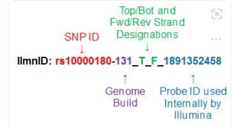

SNP_processing
==============================

Notebooks for analysis are contained in the notebook folder.  Open folder and click on notebook

test data is in the data/test folder

Followed cookiecutter data science project template

basic prep for snp analysis

Project Organization
------------

    ├── LICENSE
    ├── Makefile           <- Makefile with commands like `make data` or `make train`
    ├── README.md          <- The top-level README for developers using this project.
    ├── data
    │   ├── external       <- Data from third party sources.
    │   ├── interim        <- Intermediate data that has been transformed.
    │   ├── processed      <- The final, canonical data sets for modeling.
    │   └── raw            <- The original, immutable data dump.
    │
    ├── docs               <- A default Sphinx project; see sphinx-doc.org for details
    │
    ├── models             <- Trained and serialized models, model predictions, or model summaries
    │
    ├── notebooks          <- Jupyter notebooks. Naming convention is a number (for ordering),
    │                         the creator's initials, and a short `-` delimited description, e.g.
    │                         `1.0-jqp-initial-data-exploration`.
    │
    ├── references         <- Data dictionaries, manuals, and all other explanatory materials.
    │
    ├── reports            <- Generated analysis as HTML, PDF, LaTeX, etc.
    │   └── figures        <- Generated graphics and figures to be used in reporting
    │
    ├── requirements.txt   <- The requirements file for reproducing the analysis environment, e.g.
    │                         generated with `pip freeze > requirements.txt`
    │
    ├── setup.py           <- makes project pip installable (pip install -e .) so src can be imported
    ├── src                <- Source code for use in this project.
    │   ├── __init__.py    <- Makes src a Python module
    │   │
    │   ├── data           <- Scripts to download or generate data
    │   │   └── make_dataset.py
    │   │
    │   ├── features       <- Scripts to turn raw data into features for modeling
    │   │   └── build_features.py
    │   │
    │   ├── models         <- Scripts to train models and then use trained models to make
    │   │   │                 predictions
    │   │   ├── predict_model.py
    │   │   └── train_model.py
    │   │
    │   └── visualization  <- Scripts to create exploratory and results oriented visualizations
    │       └── visualize.py
    │
    └── tox.ini            <- tox file with settings for running tox; see tox.readthedocs.io

--------

<small>Project based on the <a target="_blank" href="https://drivendata.github.io/cookiecutter-data-science/">cookiecutter data science project template</a>. #cookiecutterdatascience</small>

Additional Information

How to interpret DNA strand and allele information for Infinium genotyping array data | Illumina Knowledge

Infinium Global Screening Array v3.0 Support Files (illumina.com)

ILMN Strand: The Top/Bot (for SNPs) or Plus/Minus (for Indels) designation of the ILMN strand (Design strand).
SNP: SNP alleles as reported by assay probes. Alleles on the Design strand (the ILMN strand) are listed in order of Allele A/B.
AddressA_ID: For Infinium I bead types, this is the Address ID for the probe specific for the A allele. For Infinium II bead types, the Address ID for the probe used for both A and B alleles (in this case, AddressB_ID and AlleleB_ProbeSeq columns are empty).
AlleleA_ProbeSeq: The sequence of the probe identified in AddressA_ID column.
AddressB_ID: For Infinium I bead types, the address ID for the probe specific for the B allele.
AlleleB_ProbeSeq: For Infinium I bead types, the sequence of the probe identified in AddressB_ID column.
GenomeBuild: The NCBI Genome Build referenced for information about this probe in this manifest.
Chr: Chromosome containing the SNP.
MapInfo: Chromosomal coordinates of the SNP.
Ploidy: Ploidy of the target organism. For humans, autosomes are diploid, mitochondria and Y chromosome are monoploid.
Species: Species targeted by the probes in this BeadArray.
Source: The database source of the SNP, if available (eg, dbSNP).
SourceVersion: The database (Source) version, if available, which was referenced for the SNP to create the manifest.
Source Strand: The Top/Bot (for SNPs) or Plus/Minus (for Indels) designation for the Source strand.
Source Seq: The sequence of the Source strand.
TopGenomicSeq (in *.csv version of manifest, but not in *.bpm): The sequence of the Top strand (for SNPs) or the Plus strand (for Indels).
BeadSetID: An identifier used in the manufacture of BeadChips.
Exp_Clusters: The number of clusters expected to be generated by each SNP: 1 for nonpolymorphic probes, 2 for mitochondrial DNA and Y chromosome loci, 3 for any other loci for a diploid organism.
Ref Strand: Plus/Minus (+/-) designation for the ILMN strand.

From <https://knowledge.illumina.com/microarray/general/microarray-general-reference_material-list/000001565>

